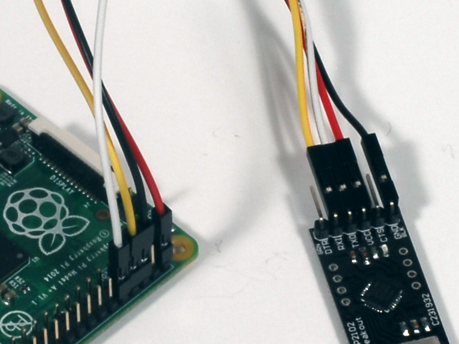

## Working with the console cable

*Written by Pat Hanrahan*

The usb serial cable can be used to communicate
between your lqptop and the Raspberry Pi.

One use of the usb serial cable is to implement a console.
The console acts as a terminal connected to the Pi.

Another use of the serial cable is to implement
a bootloader. With a bootloader, you don't need
to continually eject and insert the SDHC card.
Instead you can send the program you want to
run directly to the Raspberry Pi without
first storing it on the SDHC card.

The usb serial cable can also be used to power your Pi.

### Connecting the usb serial cable to the Raspberry Pi 

In this course, we will be using a CP2102 usb serial breakout board.
The CP2102 is the chip that converts from a
serial interface to a usb interface.

On`one end of the breakout board is a usb Type A connecter.
The breakout board plugs into any usb port on your laptop.

The other end of the console cable contains a 6 pin header.

Two of the pins deliver 5V and GND. 
They can be used to power the Pi;
for details, consult the [Powering the Pi Guide](power.md).

Two other pins are used for transmitting (TX)
and receiving (RX).
The Pi also has a TX and RX pin on the GPIO header.
These pins are on the outside of the header.
Starting at the top, we have

     2 5V
     4 5V
     6 GND
     8 TX 
    10 RX

By convention, the transmit TX on one end is connected
to the receive RX on the other end.

The proper connections are shown below

In this configuration, the yellow wire connects
the RX header pin on the usb serial breakout board
to the TX GPIO Pin 8 on the Pi's header.
The orange wire connects the TX header pin
to the RX GPIO Pin 10.

