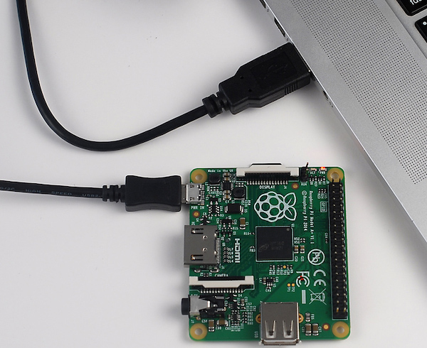
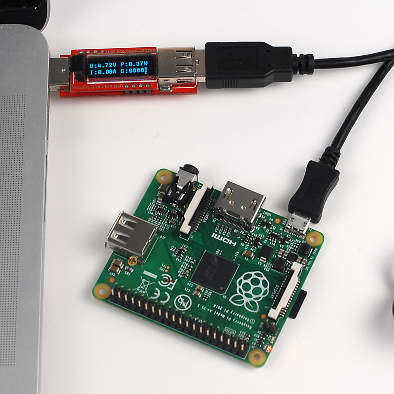
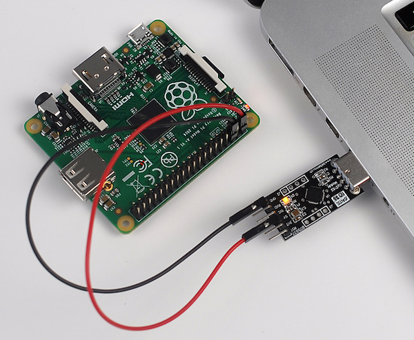
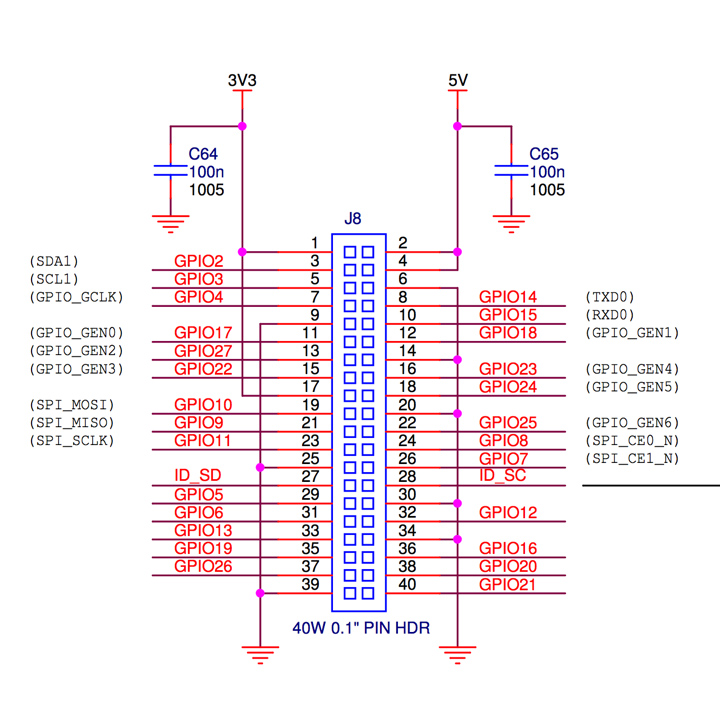
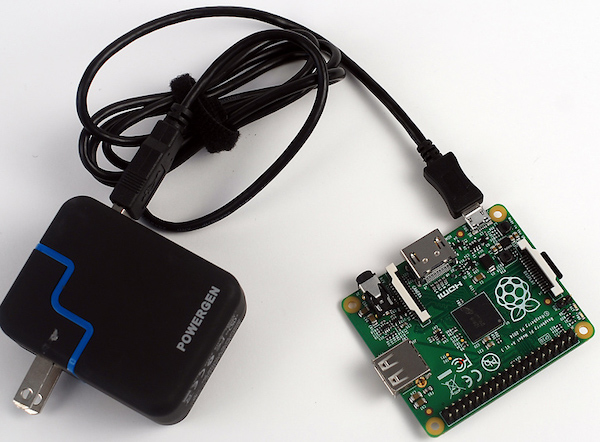

## Powering the Raspberry Pi A+ and B+

*Written by Pat Hanrahan*

**Warning: This guide applies to the models A+ and B+, and not A and B**

### Powering using a micro-usb cable

The simplest way to power the Raspberry Pi is with a micro-usb
cable connected to a usb port on a laptop. The power LED is
lit if the Raspberry Pi is receiving power.

Note that there are different types of usb connectors.
The Raspberry Pi uses a micro-usb connector.

Note also that there is also a large USB port
(on the bottom of the Raspberry Pi board).
The large usb connector is not used to power the Pi.

Raspberry Pi A+ does not need much power. 
We can measure how much power the Raspberry Pi requires
by using an inline power meter.

The usb specification says that usb port should supply 5V,
and up too 500 mA of current.
Our experiment shows that the usb port has a voltage of 4.72V,
is supplying 80 mA of current,
and the total power being consumed is 0.37 W.
That is not a lot of power! 

Note, however, that the power used 
may go up if you are using LEDs and other peripherals.

### Powering using the usb serial break out board

Another common way to power the Pi is 
to use the usb serial break out board.
The header on the break out board has pins for 5V and GND.
These are connected to the Raspberry Pi's GPIO pins as shown.

Be careful that you connect things up properly.
For reference, here is a snapshot of the relevant
part of the schematic.

### Powering using the micro-usb cable connected to an AC adapter

You can also directly power it with a AC adapter. 
The same kind that you use to charge your phone..

