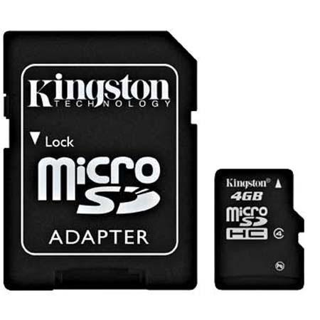
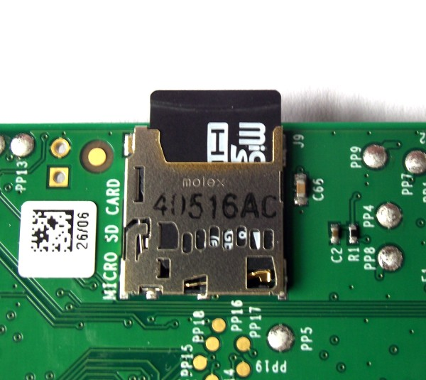
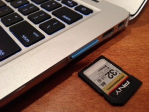
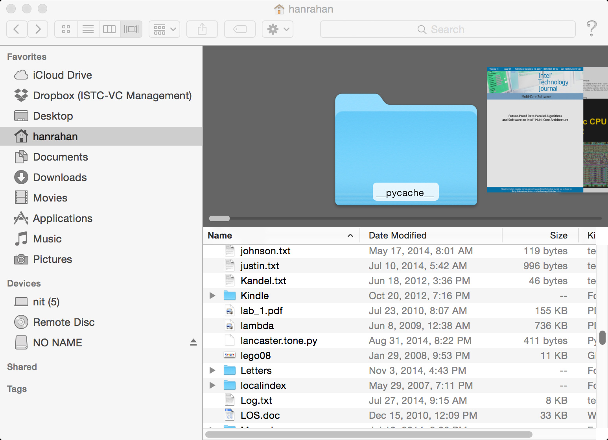

## Working with SD cards

*Written by Pat Hanrahan*

### SDHC card

Your Raspberry Pi kit contains a 
Kingston 4GB micro class 4 SDHC card.
A secure digital (SD) contains non-volatile memory for storage. 
A HC in SDHC stands for high capacity.

The Raspberry Pi runs the software on the SDHC card
installed in the SD card holder on the bottom of the
printed circuit board.

### Mounting the SDHC Card in your laptop

Most laptops contain a SD slot.
You need to insert the SDHC card into your laptop,
and mount the file system.

- On the Macbook Pro,
the card holder is on the right-hand side of the machine.

When you insert the SDHC card it should mount automatically.
You should see it show up in your finder along with
other mounted file systems. 

Verify that the card is mounted.

    % ls /Volumes
    Macintosh HD    NO NAME

By default, the volume is named `NO NAME`.

- On Linux, the SDHC ...

### Download and install firmware

Now, download the Raspberry Pi firmware from

    https://github.com/cs107e/firmware

There should be 6 files.

    % ls firmware
    blink.bin   bootloader.bin  kernel.img
    bootcode.bin    config.txt  start.elf

Recall that `bootcode.bin` is the bootloader for the GPU,
`start.elf` is the GPU start up code,
and `kernel.img` is the program run by the Pi.
Normally, `kernel.img` is the linux kernel.
In this course,
we will run replace this file with our own program.

Copy these files onto your SDHC Card.

### Eject your SDHC card

- On the Mac, go to the finder and click on the Eject icon
next to the file name.

- On linux, ...

### Troubleshooting

1. The SDHC cards we are using are formatted with a FAT32 filesystem.
If this file system is corrupted, you will need to reformat the
file system. Consult the internet for how to do this.

2. The Raspberry Pi can become wedged if `kernel.img` has bugs
or becomes corrupted.
You can always recover to a known state by copying the
original firmware to the SDHC card.

