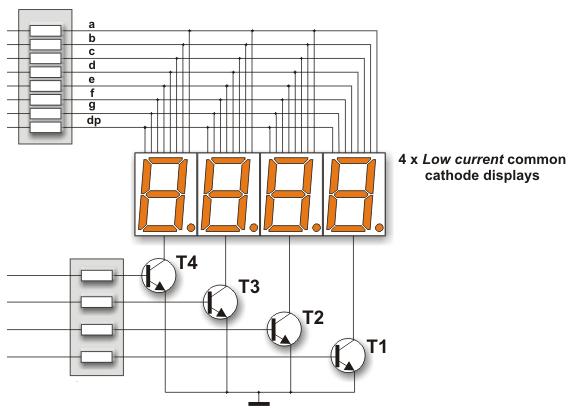
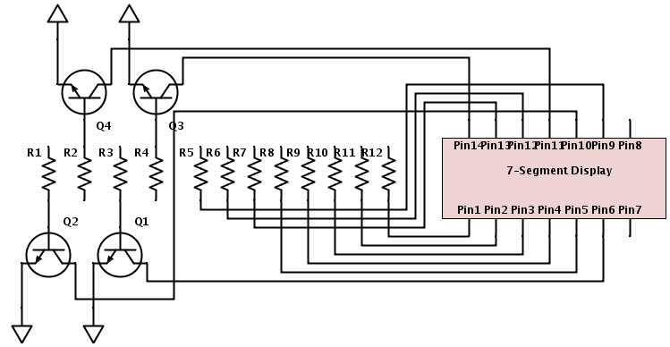
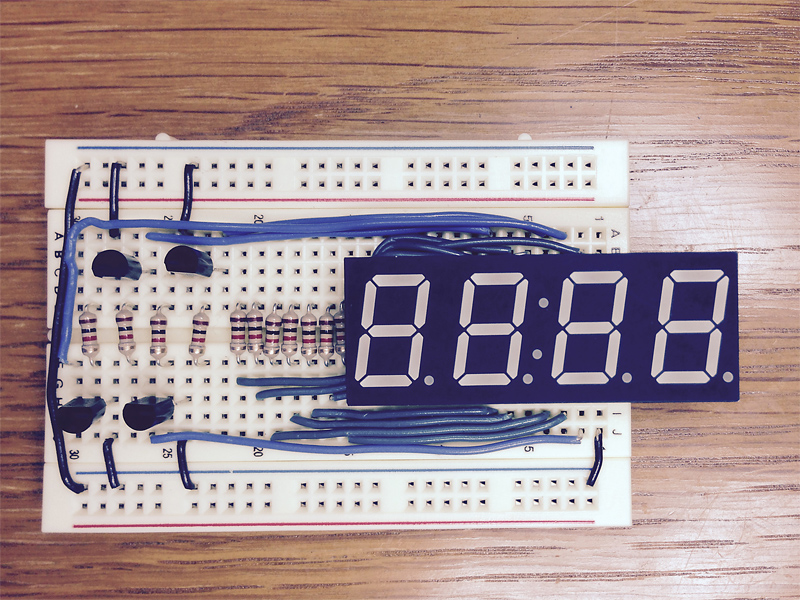
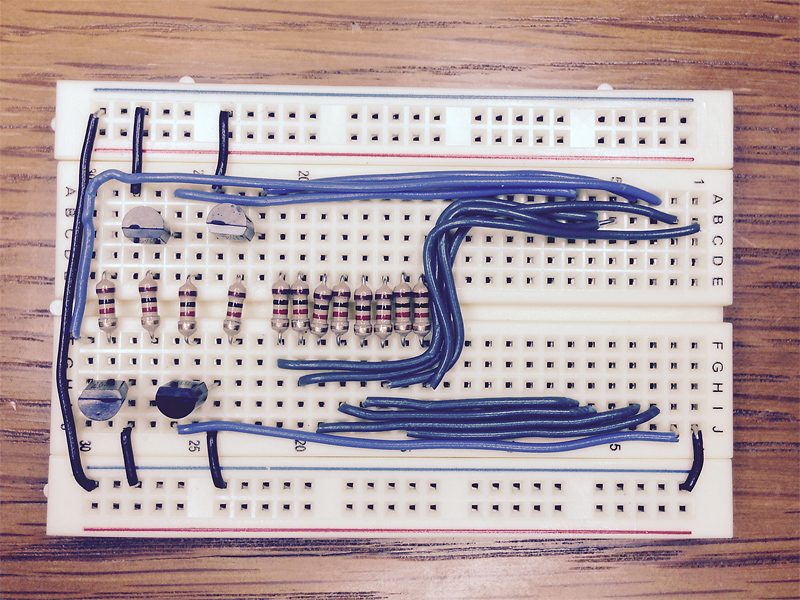
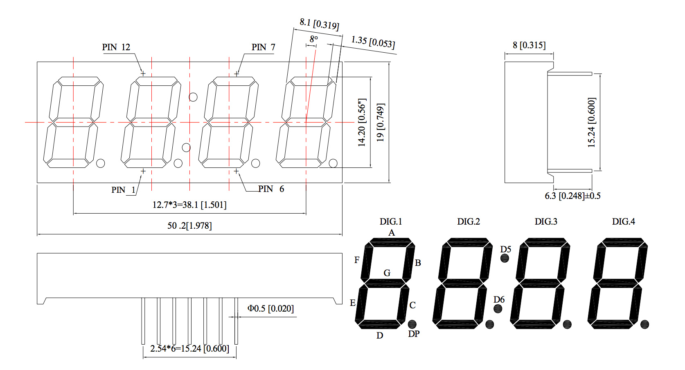
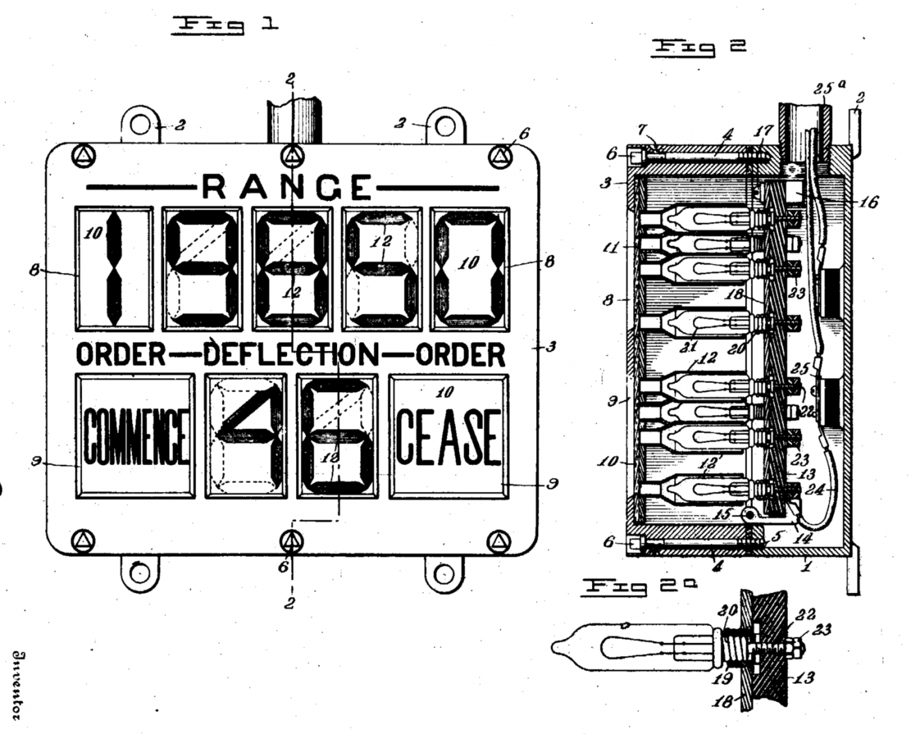

## Lab 2: Below C Level

*Lab written by Pat Hanrahan*

Death Valley, CA.

### Goals

During this lab you will:

1 Learn how to simulate the ARM processor using gdb.

2 Understand the assembly language produced by gcc when compiling a C program.

3 Setup up a 4-digit 7-segment display 
for your next assignment - building a clock.

We have broken the lab into 3 sections. 
To complete the lab,
you must answer the questions in the 
[check list](checklist.md).

### Prelab preparation

To prepare for this lab, you should do the following.

1 Read the [gdb](../../guides/gdb.md) tutorial 
about how to debug the ARM processor using 
gdb in simulate mode.

2 Read the [gcc](../../guides/gcc.md) tutorial
about how to compile C programs for bare metal
programming on the Raspberry Pi.

3 Read the [make](../../guides/make.md) guide
on setting up makefiles for cross-development
on the Pi.

To start this lab, find the `courseware/labs/lab2/code` directory.
You may need to pull from the `cs107e/courseware` repository
to get the latest code.
There are four sub-directories, `blink`, `simple`, `volatile`, and `opt`. 
Make a working copy of these four directories and proceed.

### Lab exercises

1 **Simulate the blink program using gdb**

The goal of the first exercise is to teach you how
to use gdb in ARM simulation mode. 
This is useful as a way of learning what
happens when ARM instructions are executed,
and to debug programs.

Change to the blink directory.
Assemble and link the program using make.

    % make
    arm-none-eabi-as -g blink.s -o blink.o
    arm-none-eabi-ld blink.o -o blink.exe

Follow the steps in the [gdb guide](../../guides/gdb.md).
This guide walks you through how to setup gdb 
to simulate the ARM processor.
You will load `blink.exe`,
set a breakpoint at `_start`, and then run the program.
Execution will stop at the breakpoint,
and then you can 
single step through the program inspecting registers and memory.
Follow the entire guide and make sure you understand what is going on.

The final part of this exercise is to understand the 
*current program status register (CPSR)*.
Continue stepping through blink until you enter the delay loop.
Inspect the values of `CPSR` each time through the loop.
What value does `CPSR` have when `bne` returns to `wait1`?
What values does `CPSR` have when `bne` does not branch,
and the loop is exited?

Record your answers to the first question on the check list.

2 **Compiling C to assembly**

The goal of the second exercise
is to understand how C is translated into assembly language.
We want you to have an intuitive understanding of 
what the processor does when you write C programs,
and to be able to inspect the results to check 
that what you expect to happen does in fact happen.
As we will see, sometimes the assembly language
produced by the C compiler can be surprising.

Change to the `simple` directory.

Study the makefile.

    % cat Makefile
    ARMGNU = arm-none-eabi
    CFLAGS  = -O2 -nostdlib -nostartfiles -ffreestanding

    all:
        $(ARMGNU)-gcc -c $(CFLAGS) simple.c
        $(ARMGNU)-objdump simple.o -d > simple.s

    clean:
        rm *.s *.o 

This makefile first compiles `simple.c` to make `simple.o`.
It then disassembles `simple.o` to produce the
assembly language program `simple.s`.

    % make
    arm-none-eabi-gcc -c -O2 -nostdlib -nostartfiles -ffreestanding simple.c
    arm-none-eabi-objdump simple.o -d > simple.s
    % ls
    Makefile    simple.c     simple.o     simple.s

Look at the functions 
`simple_mul_3`, 
`simple_mul_12`, 
`simple_div_3`, 
`simple_div`, 
`deadcode`, and
`foo`.
Note that the instruction `bx lr` returns from the subroutine.
We will discuss how subroutines are called in the next lecture.

Does the assembly language match what you expect?
What optimizations are being made by gcc.

Now change into the directory `volatile`,
and take a look at `volatile.c`

    int volatileint(void)
    {
        volatile int *ptr = (int*)0x20200008;
        int val;
        int i;

        for( i = 0; i < 10; i++ )
           val = *ptr;
        return val;
    }

Inspect the assembly language that was produced. 
Do you understand what is going on?

Remove the `volatile` keyword

    int *ptr = (int*)0x20200008;

Look at the assembly language after the change. What happened?

The `volatile` keyword is necessary because if you
read from a GPIO register, it may change on its own
without the program doing anything.
The C compiler may assume nothing has changed,
when it has in fact changed.
If nothing changes, gcc is going optimize the code,
in this case removing the entire loop!

Finally, if you have time and want to try some more complicated examples,
change to the `opt` directory. 
Look at the code generated for different types of 'switch' statements.

3 **Wire up your 4-digit 7-segment display**

Your next assignment will be to build a simple clock
using a 4-digit 7-segment display. 

Each 7-segment display is comprised of 7 individually
lightable LEDs, normally labeled A, B, C, D, E, F, G.
There is also a decimal point labeled dp.
The displays we will use are called common cathode displays.
The cathode is common to all the LEDs. 

 

We will be using a display with 4 digits,
all integrated into a single unit.
The displays we are using are from 
[Adafruit](http://www.adafruit.com/products/865).

In this lab, you should wire up the display on your breadboard.
Here is the schematic for the entire circuit.

The anodes for the LEDs comprising each segment are
labeled A, B, C, D, E, F, G and "colon",
and correspond to the segments of the digit as shown above.

Each of the anodes should be connected to a 1K
current limiting resistor (shown as a rectangle in the schematic).
One end of the resistor will connect to the GPIO pin on the raspberry Pi,
and the other end to the pins on the 4-digit display.

In the schematic, you may notice that each segment (A-G) is wired to all 
four digits (this wiring is internal to the display). To control which 
digit is lit up at any one time, we will use bipolar-junction transistors,
or BJTs. 
There are 4 transistors, one per digit.
The base of each transistor will be connected to the
GPIO pin on the Raspberry Pi (through a resistor).
The collector of the transistor is connected
to the pin on the 4-digit display. 
The emitter is connected to ground.
When the transistor is "on" (3.3V applied from the GPIO at the base
of the transistor),
it will allow current to flow from the common cathode of one of the
display digits to ground, thus completing the circuit 
and lighting up that digit. 
The following diagram identifies which
pins on the 2N3904 are collector, base, and emitter.

Below is a schematic of the entire circuit laid out in a way that fits on 
your small breadboard. Pins 7 and 8 on the display control the colon and can 
be wired to ground and 3.3V (through a resistor) if you wish. 

We have also included two photos of a completed 
breadboarded circuit. We highly recommend you
build and test the circuit in sections. 
See our recommendations below the images.

Test it as you build it step-by-step.
For example, start by connecting one end of a resistor to the A pin (pin 13),
and the other end to 3.3V.
Next, ground digit 1 (pin 14).
Providing power to the anode while the cathode is grounded should
turn on segment A.
If you connect all the 
display cathode pins to ground (pins 6, 10, 11, 14) and all the anode pins to 
resistors, you should be able to check every segment be applying 3.3V to the 
other end of each resistor. Once you are satisfied that the display is wired 
correctly, insert the transistors between the cathodes and ground to act as 
switches. Apply 3.3V to the base of the transistors (through the resistors), 
and ensure your segments still light up as expected.

Remember to answer the checklist questions. What segments do you need to 
turn on to make a 0?  A 1?

**Additional Resources**

Here are pin-outs for the 4-digit displays. The pin on the lower
left when looking at the display in reading order is labeled pin 1.

 

For additional information of these parts, 
consult the [datasheet](doc/4digit.pdf).

The original 7 (8?) segment display invented in 1908 by Frank Wood
[Hackaday](http://hackaday.com/2015/01/09/the-original-seven-eight-segment-display/)

